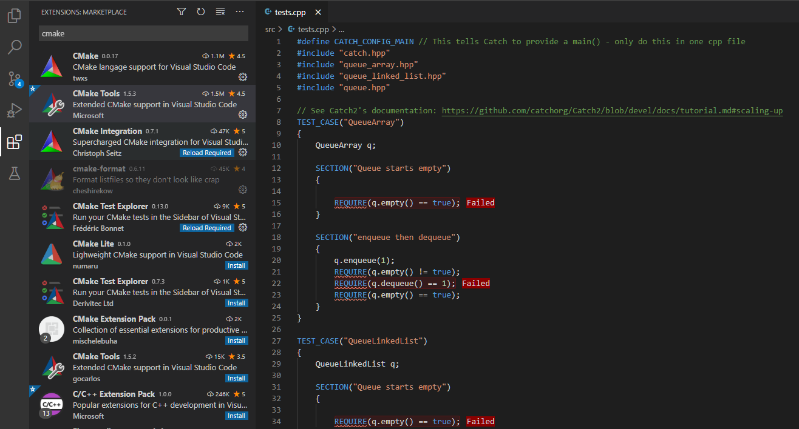

# 270191U025-Software-Architecture-assignment-template

## Meta Information To Instructors (REMOVE THIS FROM ASSIGNMENT)

This repository contains a template for C++ based assignements in the 'Software Architecture' course.
The template provides a CMake-based build system that makes it easy that makes it easy to build and test the students code.

The intention is to use this template as the seed project to several other repos, specifically one for each assignment in the course.
An assignement in GitHub classroom provides the students with the appropriate files.

To detect tampering with the grading file calculate the md5 checksum. The most portable way of doing this is using python:

```bash
python -c "import hashlib; print(hashlib.md5(open('autograde.py','rb').read()).hexdigest())"
```

The md5 checksum should be: `3fb245f0f15bf8b4aeb34e9b5adc1289` -- if it is not then the file has been modified, which may or may not be intentional.

## Assignment

In this exercise you will:

1. [Preliminaries; Installing Dependencies](#Dependencies)
2. [Install and familiarize yourself with Git](#Familiarize-youself-with-Git)
3. [Examine the Repository Template](#Repository-Structure)
4. [Automatic Grading](#Test-Suite-and-Grading)
5. [Run Automatic Grading Script](Correcting-the-Code)

### Dependencies

The project template and associated script dependes on the following programs being installed and added to your systems path variable.
In practical terms this means that the program can be located from the command line.
The easiest way to check whether a program is in the systems path is to attempt launching it from the command line.

For example to check if the python interpreter is installed:

```bash
python
```

Make sure the following programs are installed and can be accessed from the systems path:

- C/C++ compiler such as [gcc](https://gcc.gnu.org/), [msvc](https://visualstudio.microsoft.com/vs/features/cplusplus/) or [clang](https://clang.llvm.org/)
- [CMake](https://cmake.org/)
- [Python](https://www.python.org/)
- [Git](https://git-scm.com/downloads)
- [Clang-Tidy\*](https://clang.llvm.org/extra/clang-tidy/)
- [CppCheck\*](http://cppcheck.sourceforge.net/)
- [Valgrind\*](https://valgrind.org/)

Dependencies marked with '\*' are optional.

On Ubuntu you can install these using:

```
sudo apt install build-essential cmake python3 git clang-tidy cppcheck python3
```

You may install an CMake integration in VSCode that makes it easier to build and debug you code.
The 'CMake' and 'CMake Tools' are recommended.



**There are many ways to install these and often the preferred way depends on the particular OS. The most general advice is reading the install instructions found at their respective webpages.**

### Familiarize youself with Git

Git is a version control system that is used extensively in software development, that allows you to store code while maintaining a history of changes made previously.
GitHub is a popular service that hosts repositories and provides additional services.

The first part of this exercise is to install and familiarize yourself with git to a point where you can download the assignment template and subsequently submit the finished assignment through Git.
There are countless guides online on how to install and use Git, one of them being:

- [Text Based Guide](https://guides.github.com/introduction/git-handbook/)

- [Video](https://www.youtube.com/watch?v=SWYqp7iY_Tc)

Clone the repository and code away. Focus on the basic commands: `clone`, `commit`, `pull`, and `push`.

### Repository Structure

For assignment you are provided a set of files that help you get started with the assignment.

The files are:

1. CMakeLists.txt: build script similar to a makefile, but cross-platform
2. autograde.py: python script for building and grading your submission
3. .gitignore: defines which types of files should not be tracked by Git

Source and header files are stored in the respective folders:

1. include: Contains C++ header files
2. src: include C++ source files

### Test-Suite and Grading

A central goal of this course is to improve your ability to write high quality and 'correct' code. Part of this effort is an increased emphasis on systematic testing.

For each exercise you are provided a set of unit tests as part of the handout that can be run to verify which parts of your code works and which parts do not. To test your code run the `autograde.py` script using python:

```bash
> python autograde.py
...

1: Test command: C:\Users\clega\Desktop\repos\270191U025-Software-Architecture-assignment-template\build\Debug\tests.exe
1: Test timeout computed to be: 10000000
1:
1: ~~~~~~~~~~~~~~~~~~~~~~~~~~~~~~~~~~~~~~~~~~~~~~~~~~~~~~~~~~~~~~~~~~~~~~~~~~~~~~~
1: tests.exe is a Catch v2.13.4 host application.
1: Run with -? for options
1:
1: -------------------------------------------------------------------------------
1: Addition
1:   0 + 1 is 1
1: -------------------------------------------------------------------------------
1: C:\Users\clega\Desktop\repos\270191U025-Software-Architecture-assignment-template\src\tests.cpp(16)
1: ...............................................................................
1:
1: C:\Users\clega\Desktop\repos\270191U025-Software-Architecture-assignment-template\src\tests.cpp(18): FAILED:
1:   REQUIRE( sum(0, 1) )
1: with expansion:
1:   0
1:
1: ===============================================================================
1: test cases: 1 | 1 failed
1: assertions: 2 | 1 passed | 1 failed
1:
1/1 Test #1: usage_test .......................***Failed    0.02 sec

0% tests passed, 1 tests failed out of 1

Total Test time (real) =   0.02 sec

The following tests FAILED:
          1 - usage_test (Failed)

INFO:.\autograde.py:Running Memory Checker
UpdateCTestConfiguration  from :C:/Users/clega/Desktop/repos/270191U025-Software-Architecture-assignment-template/build/DartConfiguration.tcl
Cannot find file: C:/Users/clega/Desktop/repos/270191U025-Software-Architecture-assignment-template/build/DartConfiguration.tcl
   Site:
   Build name: (empty)
UpdateCTestConfiguration  from :C:/Users/clega/Desktop/repos/270191U025-Software-Architecture-assignment-template/build/DartConfiguration.tcl
Cannot find file: C:/Users/clega/Desktop/repos/270191U025-Software-Architecture-assignment-template/build/DartConfiguration.tcl
Memory check project C:/Users/clega/Desktop/repos/270191U025-Software-Architecture-assignment-template/build
Memory checker (MemoryCheckCommand) not set, or cannot find the specified program.
Errors while running CTest
INFO:.\autograde.py:
#######################################################################################################
Final grade is: 0

grade = test_passed_fraction* 70 + memory_check_passed * 20 + static_analysis_passed * 10
0 = 0% * 70 + False * 20 + False * 10
#######################################################################################################
```

**The script is 'work in progress' if you have suggestion for improvements contact the TA. However, do not modify the script, a checksum is used to check the integrity of the file. Incorrect checksum ⟹ no pass.**

### Correcting the Code

The output from the grading script shows us that the implementation is not quite there.

```cpp
int sum(int a, int b)
{
    int unsafe[10];
    unsafe[10] = 1;
    int* leak = (int*)malloc(sizeof(int));
    return a;
}
```

Correct the code and re-run the `autograde.py` script, you shoulde see something along the lines of:

```bash
> python autograde.py

...

#######################################################################################################

Summary:
- test passed: 100.0%
- memory check: ToolStatus.NOT_FOUND
- static analysis (cppcheck): ToolStatus.PASSED
- static analysis (clang-tidy): ToolStatus.PASSED

Grading Scheme:
grade = test_passed_fraction * 70 + memory_check_passed * 20 + static_analysis_passed * 10

Final grade is: 80.0

#######################################################################################################
```

N
